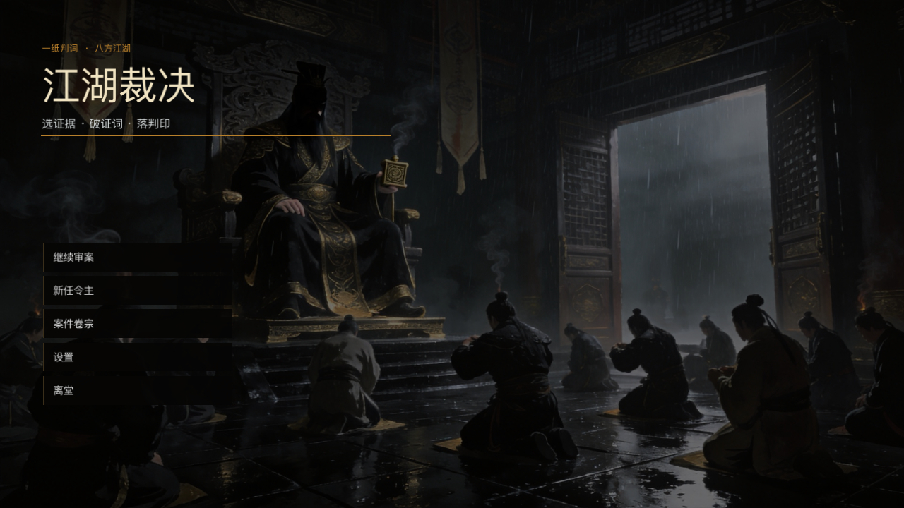
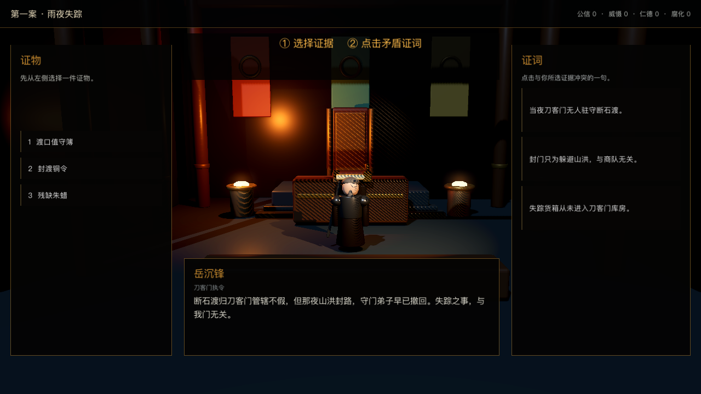
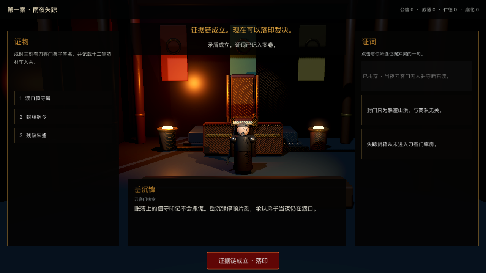
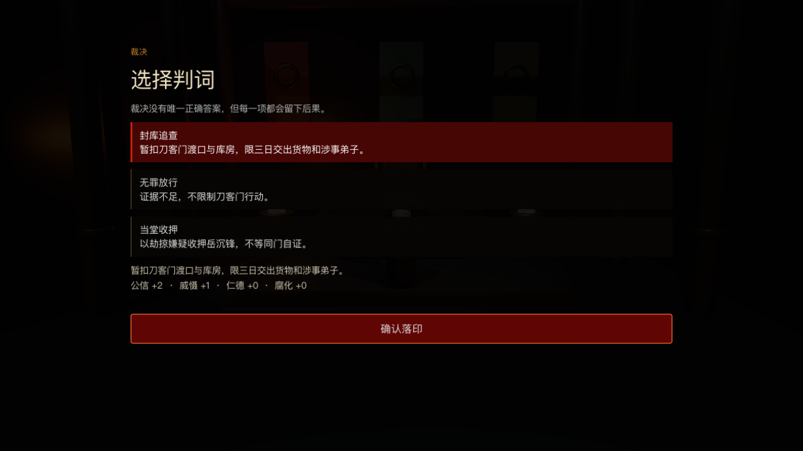
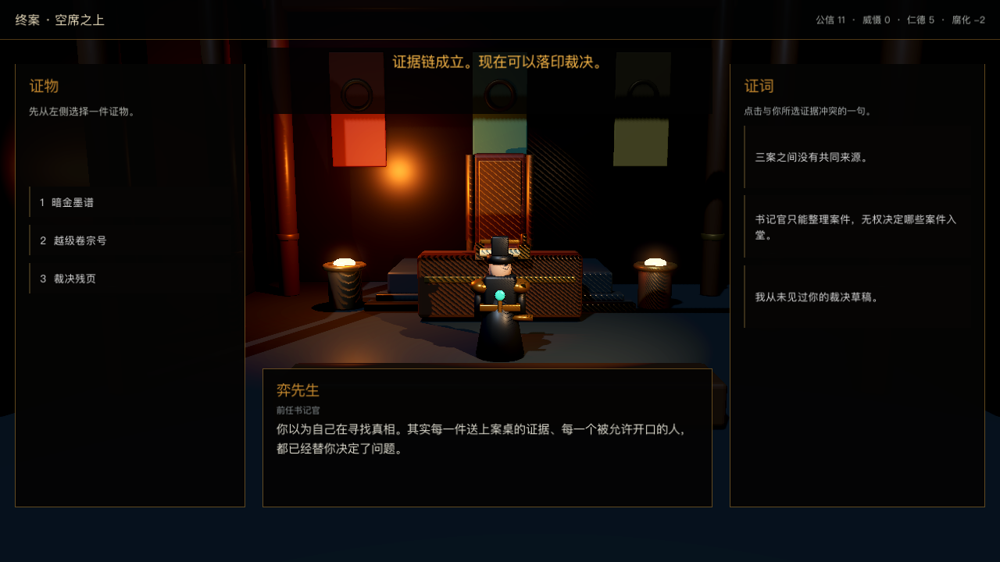

# 江湖裁决

一款以“选证据、破证词、落判印”为核心循环的新中式 3D 政治推理游戏。
V1 包含四个完整案件、三种终局、确定性事实图、离线 NPC 表演、存档与
macOS 发布管线。



## 核心规则

1. 从左侧选择一件证据。
2. 点击右侧与证据矛盾的证词。
3. 击穿必要证词后选择判词并落印。

AI 只负责润色表演台词；案件事实、矛盾关系和裁决后果由本地数据确定。

## 技术栈

- Godot 4.7.2
- Blender 5.2 / glTF
- GDScript
- macOS Universal Export

## 运行

使用 Godot 4.7.2 打开 `game/project.godot`，或执行：

```bash
godot --path game
```

## 构建

```bash
./pipeline/build_release.sh
```

发布应用生成到 `dist/release/江湖裁决.app`。该目录属于本机构建产物，不提交
到 Git。

## 验收

```bash
godot --headless --path game --script tests/validate_campaign_data.gd
godot --headless --path game --script tests/validate_assets.gd
godot --headless --path game --script tests/validate_full_campaign.gd
godot --headless --path game --script tests/validate_save.gd
godot --headless --path game --script tests/validate_endings.gd
godot --path game --script tests/validate_mouse_flow.gd
```

已覆盖四案完整通关、三种结局、事实引用校验、未知事实拒绝、原子存档、
鼠标点击流程和 1280×720 界面截图。

## 效果展示

| 审理 | 证据成立 |
|---|---|
|  |  |

| 裁决 | 终案 |
|---|---|
|  |  |

## 目录

- `game/`：Godot 工程、案件数据和测试
- `assets/blender/`：大堂与角色 Blender 源文件
- `reference/concepts/`：视觉参考
- `artifacts/ui/`：最终界面截图
- `docs/`：V1 规格、GDD 与资产说明
- `pipeline/`：音频生成和 macOS 构建脚本
